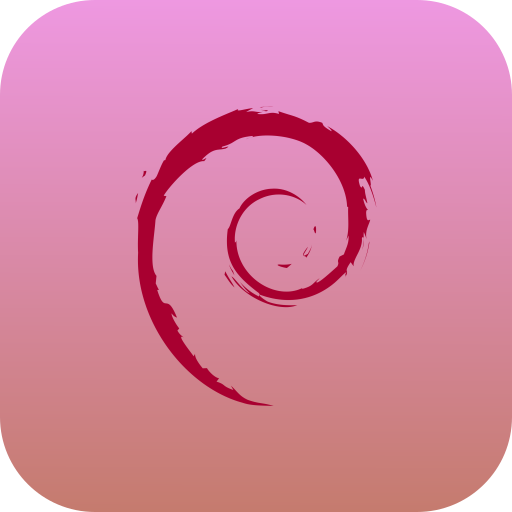
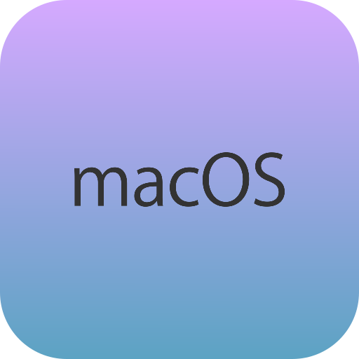

    <h1>🔹 ByteIcons</h1>
    
    
ByteIcons is a small creative project of mine. I'm working alone on it. Most Icons are made for my personal use. But i would like to provide more Icons to the community. If you want an Icon added, please open an Issue. 

> If these icons make your projects dance, a little shoutout would be awesome 🕺🏼

## 📋 Table of Contents

- [🚀 Features](#features)
- [⚙️ Installation](#installation)
  - [🔧 React](#react)
  - [🔧 Next: Image Component](#next)
- [🔧 Usage](#usage)
- [🛠️ Contributing](#contributing)
- [📜 License](#license)

## 🖼️ All Icons

    
Click to see all icons

| Icon SVG                                      | Name         |
| --------------------------------------------- | ------------ |
|            | android      |
|      | applemusic   |
|        | archlinux    |
|              | centos       |
|                  | css3         |
|              | debian       |
|  | elementaryos |
|              | fedora       |
|              | gentoo       |
|      | javascript   |
|        | kalilinux    |
|        | linuxmint    |
|                | macos        |
|            | manjaro      |
|          | opensuse     |
|                | popos        |
|      | puppylinux   |
|            | spotify      |
|    | tailwindcss  |
|                | tidal        |
|                    | tux          |
|      | typescript   |
|              | ubuntu       |
|            | windows      |
|            | zorinos      |

## ⚙️ Installation & Usage

### 🔧 React

Coming soon..

### 🔧 Next (Image Component)

Coming soon..

## 🛠️ Contributing

Please don't open a Pull Request, if you want to have icons added.
Create an issue instead.

## 📜 License

[Creative Commons Attribution 4.0 International (CC BY 4.0)](/LICENSE.md)
